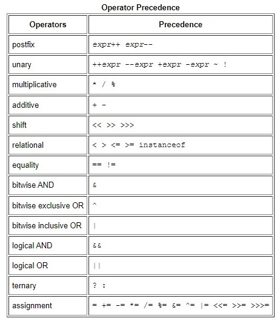

# Class-01 Reading Notes 

In this file I will be summarizing what I have learnt in class-01 reading notes which included the following resources : 
- [Java Basics](https://docs.oracle.com/javase/tutorial/java/nutsandbolts/index.html).
- [Reddit thread on compiling]().
- [XKCD: Compiling]().
- [Reading Java Documentation]().

## Java basics :
*** 
**Variables:**  
Or as been calles as well "fields",are certain places reserved in the memory to store some data in it. In Java programming language we have different types of variables which are: 
1. Instance Variables (Non-Static Fields) : variable with unique values to each class. 
2. Class Variables (Static Fields) : it is declared with the word *static* to tell the compiled that there exists only one copy for this variable and can't have another one.
3. Local Variables : a place where methods store their state in.Who can access it depends in what block of code it was declared in.
4. Parameters : they are the variables sent inside methods and functions like args[] in the main function.

When it comes to naming these variables following rules must be followed : 
- names can only contain letters , underscore or the dollar sign , preferres to begin with a letter.  
Pay attention that Java is a case-sensitive language so int a and int A are two different variables. 

- must not be a keyword or a reserved word as int boolean since boolean is a data type. and better to name your variable a meaningful name so your code becomes readable and  self documenting. 

- if your variable name contains two words it is better to use camel case like naming it variableName instead of variablename since it is easier to read.
And if your variable is a constant it is common to name it all capitalised like PI instead of pi. 

**Operations:**  
Operations in Java are symbols that is related to certain operation like smaller , equals ..etc.  
the following table taken from [The Java Tutorials by Oracle ](https://docs.oracle.com/javase/tutorial/java/nutsandbolts/operators.html)shows us most known operations with their precedence order:  
  

**Expressions, Statements, and Blocks:**  

*Expressions:*   
expressions in simple words are sentences containing variables and operations together to do a method  such as assigning  and conditional sentences.
expressions return values of the data type of the variable used in the expression.  

*Statements:*  
statements are so close to expressions , they contain :
- Assignment expressions.
- Increament and Decreament statements.
- Method invocations.
- Object creation expressions. 
- declaration statements.
- Control flow statements.

*Blocks:*   
Blocks are group of code included inside an opened and closed curly brackets {}. 
Block of code can be empty or not empty. 

**Control Flow Statements:**

In normal cases the code is been run line by line from top to down. *Control Flow Statements* are statements that break this rule with conditional statements or loops and even branching statements that makes the line of code run multiple times of never been run.

## Reddit thread on compiling:
***
From the answers of "**What does it mean to compile code?**" question is that we programmers write codes in different languages that the computer actually does not understand directly, There must be a translator between programmers and computers to translate human code into 01 language so that the computer understands it. and this translating act is what we call compiling a code. 

