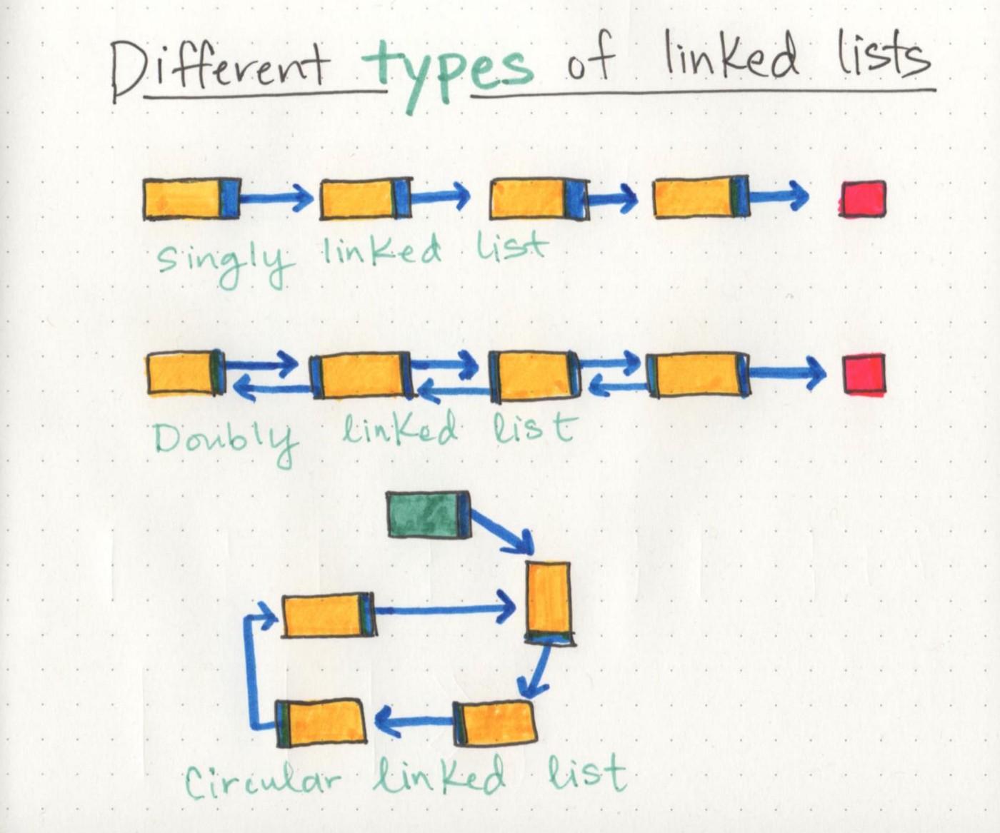

# Class-05 :Linked Lists
***

In this file I will be summarizing what I have learnt in class-05 reading notes which included the following resources : 
- [Big O: Analysis of Algorithm Efficiency](https://codefellows.github.io/common_curriculum/data_structures_and_algorithms/Code_401/class-05/resources/big_oh.html)
- [Linked Lists](https://codefellows.github.io/common_curriculum/data_structures_and_algorithms/Code_401/class-05/resources/singly_linked_list.html)
- [What’s a Linked List, Anyway pt1](https://medium.com/basecs/whats-a-linked-list-anyway-part-1-d8b7e6508b9d)
- [What’s a Linked List, Anyway pt2](https://medium.com/basecs/whats-a-linked-list-anyway-part-2-131d96f71996)

# Big O: Analysis of Algorithm Efficiency
***
Big O notations is used to discribe how much time/memory the code takes in the worst/best/average case to solve the problem , keeping in mind that the worst case is the most important so the code doesn't exceed the limits of time or memory.
we can use it to describe :
- Time complexity.
- Memory complexity.

as an example if we looped over to assign an array of size n it is going to need time complexity of O(n) and memory complexity of O(n) as well . 
you can know more about it from the following schedual :  

# Linked Lists
***
A Linked List is a **dynamic linear data structure**, like group of people that are connected by pointing on each other and who wants to check on them for any reason must know the first person (Head) and start with him them move by looking to where this person is pointing to. but in this case you will be able to move forward only which is the *Singly Linked List*.  
But what if they were pointing with their both hands to the person next to them and the person before them? then you will be able to move forward and backward and that is the *Doubly Linked List* . and if the tail was pointing to the head? yes! a *Circular Linked List*.

Each person in a Linked List is called a *Node*.  
The first Node in the List is called the *Head*.  
To move between nodes we use method *Next* that uses pointers. 
The last Node in the List is called *Tail*.
The Tail always point to a null value , so if we want to loop over them we use while loop and we stop once `thisNode.next == null`. 

I know that sounds very close to the array but  here is the difference between a linked list and an array :
