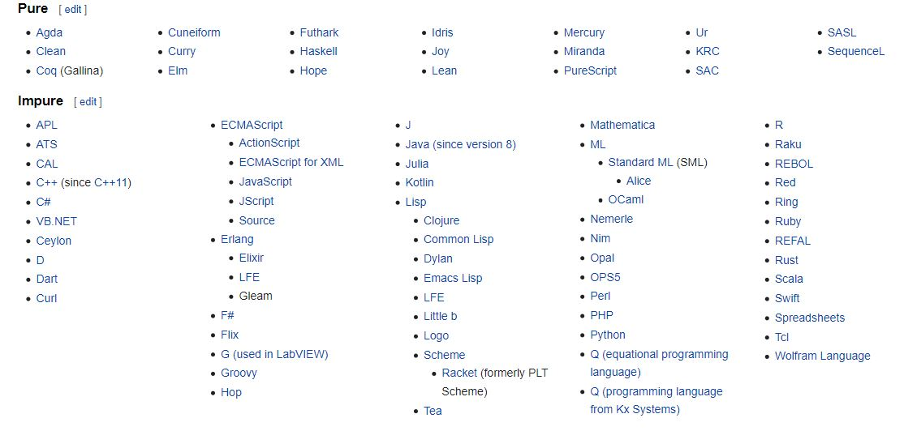

# Class-16 : Spring Authentication
***

In this file I will be summarizing what I have learnt in class-19 reading notes which included the following resources : 
- [Purely functional programming, from Wikipedia](https://en.wikipedia.org/wiki/Purely_functional_programming).

## Purely functional programming
***
### What is purely functional programming?
A purely functional programming is to write a program that doesn't use any external code that can affect your code result if that external code changed.
### What is the difference between pure and impure functional programming?
> One core difference between these two types of functions is whether or not they have side effects.  
[Pure vs Impure Functions in Functional Programming – What's the Difference?
](https://www.freecodecamp.org/news/pure-function-vs-impure-function/#:~:text=Your%20function%20is%20pure%20if,one%20or%20more%20side%20effects.)

Example of a pure functional program :
```
function updateMyName(newName) {
   const myNames = ["Oluwatobi", "Sofela"];
   myNames[myNames.length] = newName;
   return myNames;
}
```
Notice that updateMyName function doesn't use any external code which makes it a pure functional program , following an example of an impure functional program :
```
const myNames = ["Oluwatobi", "Sofela"];

function updateMyName(newName) {
  myNames.push(newName);
  return myNames;
}
```
Notice that updateMyName in here contains an external argument myNames which will affect updateMyName result in case of changing which makes it an impure functional program.

### Properties of purely functional programming:
1. **Strict versus non-strict evaluation :**
Each evaluation strategy that evaluates a purely functional program returns the same result. In particular, it ensures that the programmer does not have to consider in which order programs are evaluated, since all of them will return the same result. 

2. **Parallel computing :**
Since purely functional programming is independent by itself and doesn't interact with other external codes or arguments Purely functional programming simplifies parallel computing.

3. **Data structures**  


### Purely functional languages :

Purely functional programs can be written in languages that are not purely functional because it depends on how you write that program but a purely functional language is a language that can only write purely functional programs. Following the list of pure and impure programming languages according to Wikipedia. 

