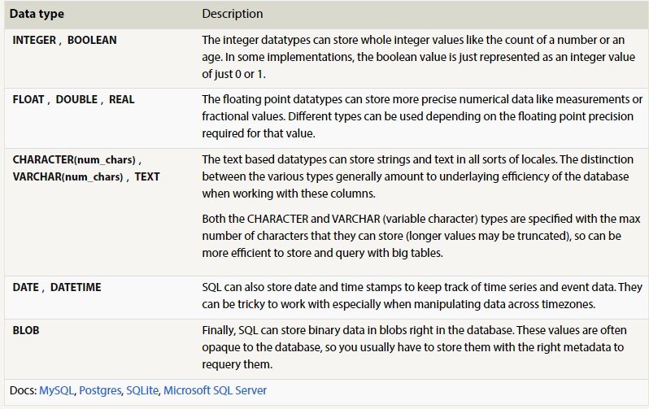
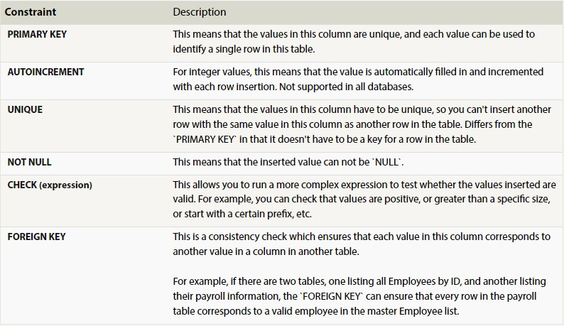

# Introduction to SQL 
**Course : [Introduction to SQL](https://sqlbolt.com/)**

In this file I will be summarizing what I have learnt in this course starting from *What is SQL* to what methods I have learnt so far to manage normal and normalized database. 

## What is SQL ?
SQL stands for Structures Query Language that allows us to manage our data in the relational database which contains number of tables that are related to eachother in someway using an Id number or any other unique key value.   
Each SQL table has a **schema** ,which is the structure that describes the table like number of columns and what data types are inside them. 

## What is Database Normalization?
It is the act of splitting a table into smaller tables in order to reduce redundancy (repeated data) and allow data in tables to grow independently from eachother. 

## Methods in SQL : 

+ ### Selecting queries :
    syntax :
```   
    SELECT data   
    FROM tableName   
    WHERE condition;
```
We can also use:   
value **(NOT)BETWEEN** value1 **AND** value2  
value **(NOT) IN** value1   
**AND** and **OR** inside the condition.    

+ ### Filtering queries :
    syntax :  
    ``` 
    SELECT DISTINCT data   
    FROM tableName   
    WHERE condition 
    ```
This method deletes dublicated rows blindly, and if you didn't specify a **WHERE** condition all rows of data will be deleted. 

+ ### Sorting queries :
    syntax : 
    ```  
    SELECT data   
    FROM tableName   
    WHERE condition  
    ORDER BY columnName ASC/DESC  
    ```
we can also use : 
**LIMIT** number ==> to return limited number of results.
**OFFSET** number ==> to specify the starting point of counting number of results. 

+ ### Joining tables :
    syntax : 
    ```  
    SELECT data   
    FROM tableName1   
    INNER JOIN tableName2  
    ON tableName1.key=tableName2.key   
    WHERE condition 
    ```

This methhod combines both tables using the key that could be an Id value or other unique value to return a result of combined data from both tables. 

+ ### Inserting data :
    syntax : 
    ```  
    INSERT INTO tableName   
    VALUES (addedValues);  
    ```
+ ### Updating data :
    syntax : 
    ```  
    UPDATE tableName  
    SET column=value  
    WHERE condition ; 
    ```  

if you didn't specify a condition the whole data in the table is going to be updated.So, it is recommended to SELECT your data before updating it in order to make sure of what data you are going to update. 

+ ### Deleting data :
    syntax :  
    ``` 
    DELETE FROM tableName   
    WHERE condition ;
    ```

if you didn't specify a condition the whole data in the table is going to be deleted.So, it is recommended to SELECT your data before deleting it in order to make sure of what data you are going to delete.

+ ### Creating tables :
    syntax : 
    ```  
    CREATE TABLE IF NOT EXISTS tableName (  
        columnName DataType OptionalTableConsistant DEFAULT defaultValue ,  
        columnName DataType OptionalTableConsistant DEFAULT defaultValue );  
    ) 
    ```

In the following picture you will find most known  data types can be used when creating tables:



 ###### This table is taken from the same tutorial. 

 In the following picture you will find most known  constraints can be used when creating tables:

 

 ###### This table is taken from the same tutorial. 

+ ### Adding columns :
    syntax :  
    ``` 
    ALTER TABLE tableName   
    ADD columnName DataType OptionalTableConsistant DEFAULT defaultValue ;
    ```

We can use **FIRST** and **AFTER** to specify the place of adding the column. 

+ ### Removing columns :
    syntax :
    ```   
    ALTER TABLE tableName   
    DROP columnName ;
    ```

+ ### Renaming the table :
    syntax : 
    ```  
    ALTER TABLE oldTableName   
    RENAME TO NewTableName;
    ```

+ ### Removing table :
    syntax :   
    ```
    DROP TABLE IF EXISTS tableName ;
    ```

This method is different than DELETE that DELETE deletes the data inside the table but not the schema. DROP drops the whole table with its schemma that it no longer exists.  
Pay attention that before deleting the table you have to handle related tables by removing dependencies like forgien keys or dropping them.   


[Click HERE](https://docs.google.com/document/d/1FA-M8SInvMmxClCFHuFGsBh6VRMzXXxPK_eAX-RkOto/edit?usp=sharing) to find screenshots of my completed tasks is the course. 

